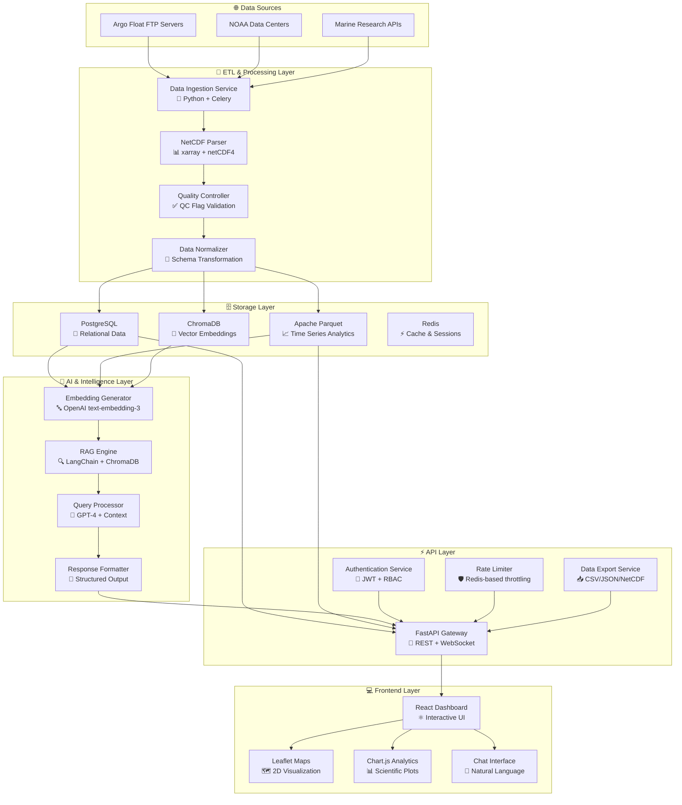
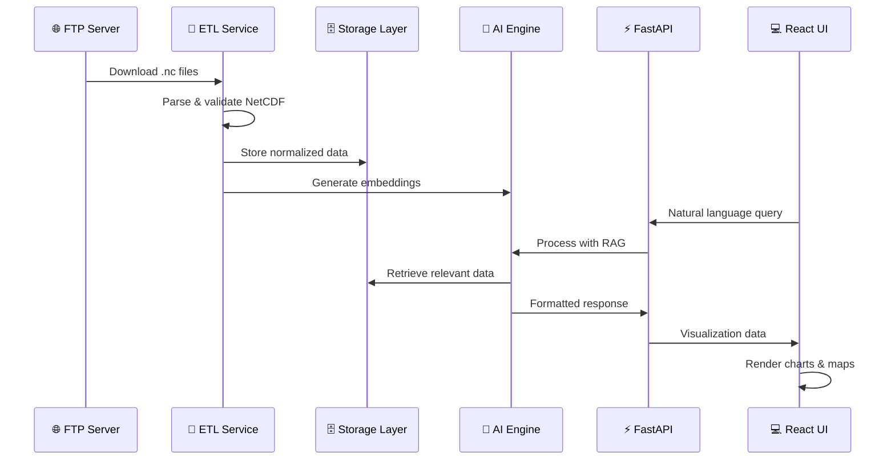
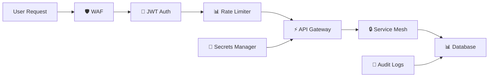

<div align="center">

# 🌊 FloatChat - Aapka Jal Saathi

**Interactive Marine Buoy Data Visualization & Natural Language Query Platform**

[](https://reactjs.org/)
[](https://python.org/)
[](https://postgresql.org/)
[](https://openai.com/)
[](LICENSE)

_Transforming marine research through intelligent data visualization and natural language queries_

[🚀 **Live Demo**](https://floatchat-ins.vercel.app/) • [📊 **Features**](#-features) • [🏗️ **Architecture**](#-system-architecture) • [🤝 **Contributing**](#-contributing)

**🌐 Try it now: [floatchat-ins.vercel.app](https://floatchat-ins.vercel.app/)**

</div>

---

## 📋 Table of Contents

- [✨ Features](#-features)
- [📐 System Architecture](#-system-architecture)
- [⚙️ Tech Stack](#️-tech-stack)
- [🚀 Getting Started](#-getting-started)
- [🛠️ ETL Pipeline](#️-etl-pipeline)
- [🎨 Dashboard Preview](#-dashboard-preview)
- [🔒 Authentication & Roles](#-authentication--roles)
- [💬 Example Queries](#-example-queries)
- [📂 Project Structure](#-project-structure)
- [🤝 Contributing](#-contributing)
- [📜 License](#-license)

---

## ✨ Features

### 🧠 **Intelligent Querying**

- **Natural Language Interface**: Query complex oceanographic data using plain English
- **RAG-Powered Responses**: Context-aware answers using Retrieval-Augmented Generation
- **Multi-Parameter Analysis**: Compare temperature, salinity, pressure, and depth profiles

### 🌍 **Advanced Visualization**

- **Interactive 2D Maps**: Leaflet-based satellite view with buoy locations
- **3D Ocean Exploration**: Cesium.js integration for immersive underwater profiling
- **Real-time Charts**: Plotly-powered interactive time series and profile plots
- **Comparative Analysis**: Side-by-side buoy comparisons and temporal analysis

### 📊 **Data Processing Excellence**

- **NetCDF Ingestion**: Automated processing of Argo float `.nc` files from FTP
- **Smart Deduplication**: Checksum, cycle number, and timestamp-based duplicate detection
- **Quality Control**: Automated QC flag validation and data integrity checks
- **Multi-format Output**: Postgres, Parquet, and Vector DB storage

### 🔐 **Enterprise-Ready Security**

- **Role-Based Access**: Researcher, Student, and Admin privilege levels
- **JWT Authentication**: Secure token-based login system
- **API Rate Limiting**: Prevent abuse with intelligent request throttling

---

## 📐 System Architecture

FloatChat implements a modern, scalable architecture designed for handling large-scale marine datasets with intelligent query processing capabilities.

### 🏗️ **High-Level Architecture**



### 🔄 **Data Processing Pipeline**



### 🏛️ **Microservices Architecture**

| Service                 | Technology         | Responsibility                 | Scaling               |
| ----------------------- | ------------------ | ------------------------------ | --------------------- |
| **🔄 Data Ingestion**   | Python + Celery    | FTP downloads, file processing | Horizontal (workers)  |
| **🧠 AI Processing**    | LangChain + OpenAI | RAG queries, embeddings        | Vertical (GPU/CPU)    |
| **⚡ API Gateway**      | FastAPI + Nginx    | Request routing, auth          | Horizontal (replicas) |
| **💻 Frontend**         | React + Vercel     | User interface, visualization  | CDN distribution      |
| **🗄️ Database Cluster** | PostgreSQL + Redis | Data persistence, caching      | Read replicas         |

### 🔐 **Security Architecture**



### 📊 **Performance Optimizations**

- **🚀 Lazy Loading**: Components and data loaded on demand
- **📦 Data Compression**: Gzip + Brotli for API responses
- **⚡ Query Caching**: Redis-based intelligent caching layer
- **🔍 Database Indexing**: Optimized for geospatial and temporal queries
- **📈 CDN Distribution**: Global content delivery for static assets

---

## ⚙️ Tech Stack

### 🐍 **Backend**

```python
# Core Processing
xarray         # NetCDF data manipulation
netCDF4        # File parsing
pandas         # Data transformation
numpy          # Numerical computing

# Database & Storage
PostgreSQL     # Primary database
Apache Parquet # Columnar storage
ChromaDB       # Vector embeddings

# AI & ML
OpenAI API     # LLM integration
LangChain      # RAG framework
scikit-learn   # ML utilities

# API & Auth
FastAPI        # REST API framework
JWT            # Authentication
Pydantic       # Data validation
```

### ⚛️ **Frontend**

```javascript
// Core Framework
React 18       // UI library
React Router   // Navigation
Context API    // State management

// Visualization
Leaflet        // 2D mapping
Cesium.js      // 3D globe
Chart.js       // Interactive charts
Plotly.js      // Scientific plotting

// Styling & UX
Tailwind CSS   // Utility-first styling
Material Icons // Icon system
Fira Sans      // Typography
```

### 🚀 **DevOps & Deployment**

- **Docker**: Containerized deployment
- **Nginx**: Reverse proxy & load balancing
- **Redis**: Caching & session storage
- **GitHub Actions**: CI/CD pipeline

---

## 🚀 Getting Started

### 📋 Prerequisites

```bash
# Required versions
Node.js >= 16.0.0
Python >= 3.9.0
PostgreSQL >= 13.0
Redis >= 6.0
```

### ⚡ Quick Setup

1. **Clone the repository**

```bash
git clone https://github.com/your-org/SIH-FloatChat.git
cd SIH-FloatChat
```

2. **Environment Setup**

```bash
# Copy environment template
cp .env.example .env

# Configure your environment
# Add OpenAI API key, database credentials, etc.
```

3. **Backend Setup**

```bash
cd backend
python -m venv venv
source venv/bin/activate  # Windows: venv\Scripts\activate
pip install -r requirements.txt

# Database setup
python manage.py migrate
python manage.py create_admin
```

4. **Frontend Setup**

```bash
cd frontend
npm install
npm run dev
```

5. **🎉 Launch Application**

```bash
# Terminal 1: Backend
cd backend && python manage.py runserver

# Terminal 2: Frontend
cd frontend && npm run dev

# Terminal 3: Vector DB
chroma run --host localhost --port 8000
```

**Access**: Open `http://localhost:3000` and start exploring! 🌊

> **⚠️ Note**: First launch will take 2-3 minutes while we populate sample data and generate embeddings.

---

## 🛠️ ETL Pipeline

### 📥 **Stage 1: Data Ingestion**

```python
# Automated FTP download
ftp_client.download_argo_files(
    date_range="2023-01-01,2024-12-31",
    regions=["indian_ocean", "arabian_sea"],
    parameters=["temperature", "salinity", "pressure"]
)
```

### 🔍 **Stage 2: Deduplication & Validation**

```python
# Smart duplicate detection
duplicates = detect_duplicates(
    methods=["checksum", "cycle_number", "juld"],
    tolerance=0.001  # 1ms time tolerance
)

# Quality control validation
qc_results = validate_quality_flags(
    temperature_qc=1,  # Good data only
    salinity_qc=1,
    position_qc=1
)
```

### 🔄 **Stage 3: Normalization**

```json
{
  "profile_meta": {
    "float_id": "1901910",
    "cycle_number": 1,
    "timestamp": "2023-03-15T12:30:00Z",
    "latitude": 15.5,
    "longitude": 68.2
  },
  "measurements": [
    {
      "pressure": 10.5,
      "temperature": 28.3,
      "salinity": 35.1,
      "depth": 10.7
    }
  ],
  "calibration": {...},
  "history": {...}
}
```

### 🗄️ **Stage 4: Multi-Storage Loading**

- **PostgreSQL**: Relational queries and CRUD operations
- **Parquet**: Columnar analytics and time-series analysis
- **ChromaDB**: Vector similarity search for RAG queries

---

## 🎨 Dashboard Preview

### 🗺️ **Interactive Map View**


_Real-time buoy locations with satellite imagery_

### 📊 **Profile Analysis**


_Multi-parameter depth profiles with comparison tools_

### 💬 **Chat Interface**


_Natural language queries with intelligent responses_

### 🌍 **3D Ocean Exploration**


_Cesium-powered underwater visualization_

---

## 🔒 Authentication & Roles

### 👥 **User Roles**

| Role              | Permissions                         | Data Access                     |
| ----------------- | ----------------------------------- | ------------------------------- |
| **🎓 Student**    | View public datasets, basic queries | Limited to educational datasets |
| **🔬 Researcher** | Full query access, data export      | All validated datasets          |
| **👤 Admin**      | User management, system config      | Complete database access        |

### 🔐 **Security Features**

- **JWT Tokens**: Secure, stateless authentication
- **Rate Limiting**: 1000 queries/hour per user
- **Data Encryption**: TLS 1.3 for all communications
- **Audit Logging**: Complete user activity tracking

---

## 💬 Example Queries

### 🌊 **Basic Queries**

```
"Show me temperature data from the Arabian Sea"
"Compare salinity between floats 1901910 and 1902050"
"Map all buoys active in March 2023"
```

### 📊 **Advanced Analysis**

```
"Find temperature anomalies greater than 2°C in the Bay of Bengal during monsoon season"
"Show me the deepest measurements from buoy 1901910 in the last 6 months"
"Compare seasonal temperature variations between 2022 and 2023 near the equator"
```

### 🔬 **Research Queries**

```
"Identify potential upwelling zones based on temperature and salinity gradients"
"Show correlation between sea surface temperature and monsoon intensity"
"Generate a climatology report for the Indian Ocean from 2020-2023"
```

---

## 📂 Project Structure

```
SIH-FloatChat/
├── 📁 backend/
│   ├── 🐍 app/
│   │   ├── api/          # FastAPI routes
│   │   ├── models/       # Database models
│   │   ├── services/     # Business logic
│   │   └── utils/        # Helper functions
│   ├── 🔄 etl/
│   │   ├── ingestion/    # FTP downloaders
│   │   ├── processing/   # NetCDF parsers
│   │   └── validation/   # QC checks
│   └── 🧠 rag/
│       ├── embeddings/   # Vector generation
│       ├── retrieval/    # Context search
│       └── generation/   # LLM responses
├── ⚛️ frontend/
│   ├── src/
│   │   ├── components/   # React components
│   │   ├── contexts/     # State management
│   │   ├── pages/        # Route components
│   │   └── services/     # API clients
│   └── public/           # Static assets
├── 📊 data/
│   ├── raw/              # Original NetCDF files
│   ├── processed/        # Normalized JSON
│   └── samples/          # Demo datasets
├── 🐳 docker/
│   ├── backend.dockerfile
│   ├── frontend.dockerfile
│   └── docker-compose.yml
├── 📚 docs/
│   ├── api/              # API documentation
│   ├── architecture/     # System design
│   └── user-guide/       # Usage tutorials
└── 🧪 tests/
    ├── backend/          # Python tests
    ├── frontend/         # React tests
    └── integration/      # E2E tests
```

---

## 🤝 Contributing

We welcome contributions from the marine research community! 🌊

### 🚀 **Getting Started**

1. Fork the repository
2. Create your feature branch: `git checkout -b feature/amazing-feature`
3. Commit changes: `git commit -m 'Add amazing feature'`
4. Push to branch: `git push origin feature/amazing-feature`
5. Open a Pull Request

### 📝 **Contribution Guidelines**

- Follow Python PEP 8 and React best practices
- Add tests for new features
- Update documentation for API changes
- Use conventional commits format

### 🐛 **Bug Reports**

Found a bug? Please create an issue with:

- **Environment**: OS, browser, Python version
- **Steps to reproduce**: Detailed reproduction steps
- **Expected vs Actual**: What should vs. what happened
- **Sample Data**: If related to specific datasets

### 💡 **Feature Requests**

Have ideas? We'd love to hear them! Open an issue with:

- **Use Case**: Why is this feature needed?
- **Proposed Solution**: How should it work?
- **Alternatives**: Other approaches considered?

---

## 📜 License

This project is licensed under the **MIT License** - see the [LICENSE](LICENSE) file for details.

```
Copyright (c) 2024 FloatChat Team

Permission is hereby granted, free of charge, to any person obtaining a copy
of this software and associated documentation files (the "Software"), to deal
in the Software without restriction, including without limitation the rights
to use, copy, modify, merge, publish, distribute, sublicense, and/or sell
copies of the Software.
```

---

<div align="center">

### 🌊 **Built with ❤️ for Smart India Hackathon 2025**

**Team FloatChat** • Transforming Marine Research Through AI

[](https://github.com/your-org/SIH-FloatChat/stargazers)
[](https://twitter.com/FloatChatApp)

[🌐 **Website**](https://floatchat.in) • [📧 **Contact**](mailto:team@floatchat.in) • [📱 **Demo**](https://demo.floatchat.in)

</div>
